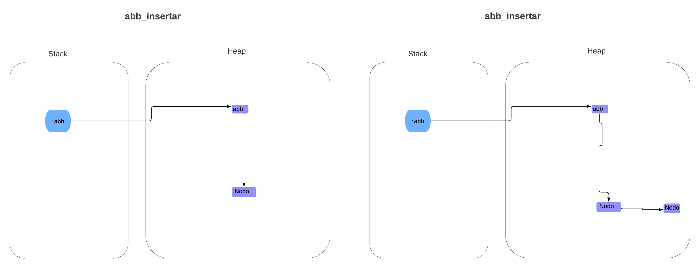
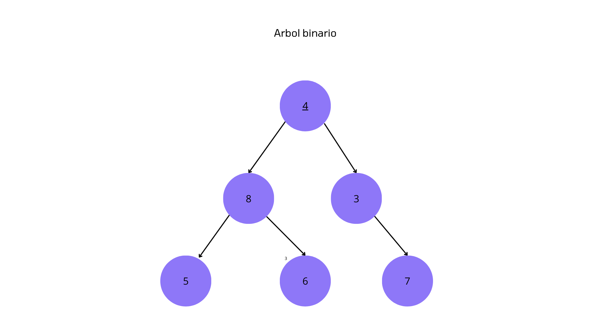
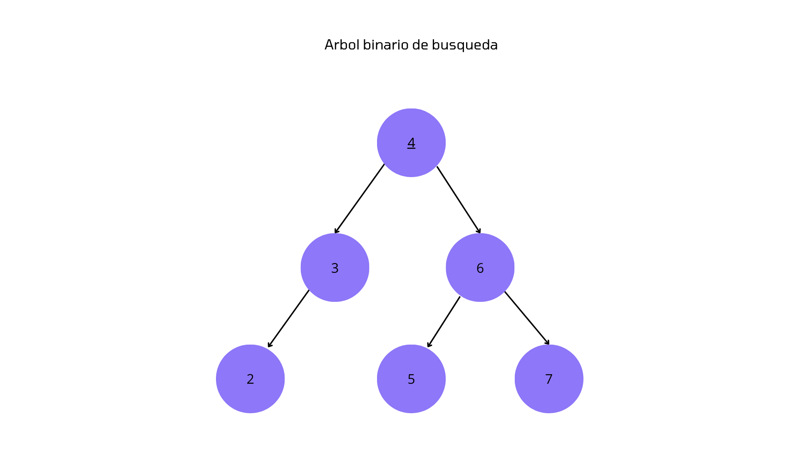
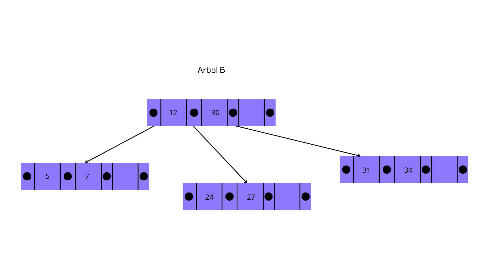

<div align="right">

</div>

# TDA ABB

## Alumno: Tobias Portella - 112257 - tobias240405@gmail.com

- Para compilar:

```bash
gcc -std=c99 -Wall -Wconversion -Wtype-limits -pedantic -Werror -O2 -g src/*.c tp_abb.c -o tp_abb 
```

- Para ejecutar:

```bash
./tp_abb pokedex.csv
```

- Para ejecutar con valgrind:
```bash
valgrind --leak-check=full --track-origins=yes --show-reachable=yes --error-exitcode=2 --show-leak-kinds=all --trace-children=yes ./tp_abb pokedex.csv
```

---

##  Funcionamiento

---El programa se encarga de recibir un archivo de pokemones con sus atributos y luego almacenarlos en un árbol binario de búsqueda, luego el programa pedirá que elijas una de dos opciones las cuales una va a ser imprimir todos los pokemones y sus atributos por pantalla, y la otra va a ser buscar un pokemon escribiendo su nombre por entrada estándar  

---el programa va a abrir un archivo CSV el cual va a contener los atributos de unos pokemones y lo va leer linea por linea usando la función leer_linea_csv, a esta función se le va a pasar el archivo, la cantidad de columnas que se desean leer, una función que recibe el string leído y un puntero al contexto, y por ultimo recibe también un puntero a un contexto. La función se va a ejecutar hasta que el archivo se quede sin lineas para leer, también se va a ejecutar la función abb_insertar() la cual va a agregar a los pokemones y los va a ordenar por su nombre.


<div align="center">

</div>

---Luego va a haber un while que va a iterar hasta que se elija una opción por entrada estandar correctamente, las opciones van a ser ingresar el nombre de un pokemon por entrada estandar y buscarlo o mostrar todos los pokemon leidos del archivo por pantalla.

---Utilizamos el iterador inorder del abb para imprimir todos los pokemones por pantalla pasandole por parametro la función imprimir_pokemones_por_pantalla() la cual imprimre por pantalla los atributos del pokemon pasado

---La otra función es encontrar_pokemon_buscado() usa abb_obtener para buscar el pokemon ingresado por entrada estandar y luego esta lo imprime por pantalla

---Luego al finalizar el programa se libera toda la memoria del programa usando sus respectivas funciónes de liberación.


## Respuestas a las preguntas teóricas
Un árbol es un tipo de dato abstracto el cual esta ordenado jerarquicamente para almacenar datos, estos tienen un nodo principal el cual se llama la raíz, y tiene(o no) distintos sub arboles con su raíz conectado al nodo raíz del árbol, estos arboles están especialmente implementados para que sea rápido buscar elementos en ellos.

Un tipo de árbol es el árbol binario el cual es un árbol que la raíz tiene solo un hijo izquierdo y un hijo derecho, y cada uno de esos hijos puede ser la raíz de su propio subarbol, una forma de usar esta estructura de datos es asignándole un valor a cada nodo y todo valor menor al de ese nodo se va a posicionar a su lado izquierdo y todo valor mayor se va a colocar al lado derecho, a esta forma de ordenar el árbol se le llama árbol binario de búsqueda.


<div align="center">

</div>


<div align="center">

</div>


Las complejidades de estos algoritmos son para árbol binario de búsqueda y tomando los peores casos, si fuera para un árbol binario común podrían ser de O(n) ya que estos no tienen un ordenamiento concreto.
las principales operaciones de los arboles son: obtener_elemento(O(log(n)), insertar_elemento(O(log(n)), eliminar_elemento(O(log(n))), recorrer(O(n)).
 
La distinción de estos arboles es importante ya que cada uno puede ser útil para diferente situaciones, por ejemplo
si estoy haciendo algo que no requiera un gran numero de datos pero quiero acceder rápido a estos un árbol de búsqueda binaria
sería bueno para esta situación pero si necesito muchos datos que pueden llegar a ocupar grandes cantidades de memoria 
un árbol B sería mucho mas útil para esta situación.
 

<div align="center">

</div>

-El abb implementado es completamente recursivo ya que considero que es la forma mas fácil de hacerlo. 

-En la función abb_quitar use una función auxiliar que devuelva un puntero a un nodo, esto ya que me resultaría mas facil hacer que el nodo padre apunte a null cuando el hijo no tenga hijos y sea eliminado, también se implemento esto para la función quitar predecesor el cual va a ser redireccionado a la posición del elemento eliminado.

-En la función vectorizar tuve problemas cuando se mandaba un vector de menor tamaño que el abb por lo que definí un vector auxiliar el cual se va a llenar por completo y luego va a copiarse al vector original el tamaño maximo. 

-En los iteradores declare una función auxiliar para cada uno para poder usar un bool* que me ayude a no seguir usando la función ingresada cuando esta ya haya devuelto false una vez.